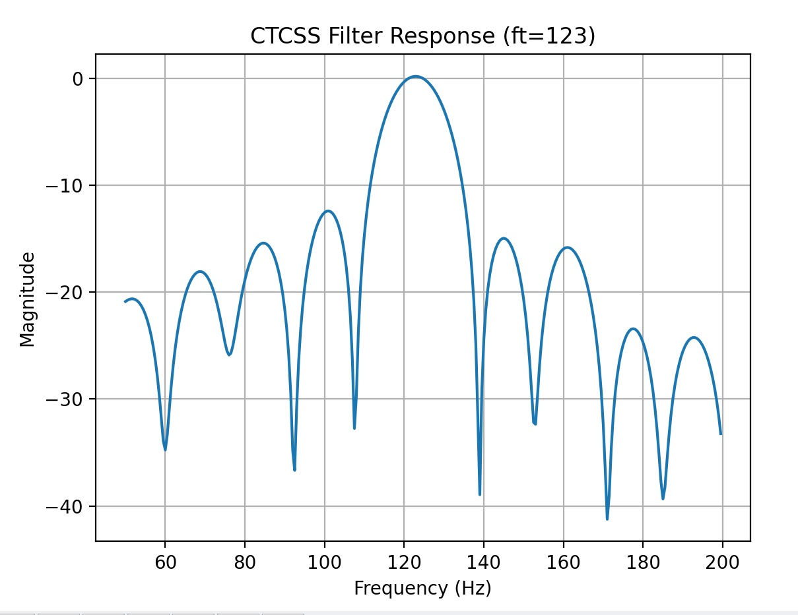
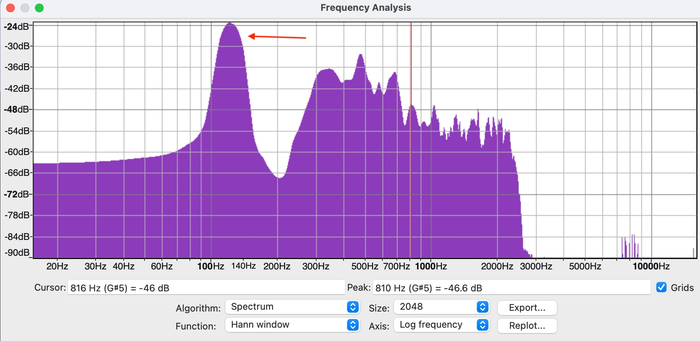
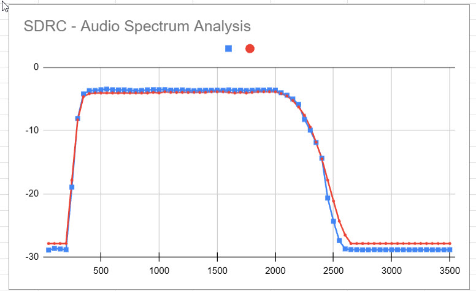

Overview
========

This is a basic two-radio repeater controller that can be used 
to create an amateur or GMRS repeater site. Our goal is to implement
as much of the repeater functionality in software as 
possible. For this reason, we call this the "Software 
Defined Repeater Controller" (SDRC) project. This Github
repo contains the source code for the controller and the 
KiCad design files for the hardware.

The hardware is on two boards. The radio interface board is on the left
and the digital control board is on the right. The digital control board
is mostly a Pico Pi 2. (To avoid any confusion: the Pico is an ARM Cortex-M33 microcontroller. This _is not_ a Linux system like you'd find on a full 
a Raspberry Pi single-board computer).


One of the advantages of an all-digital architecture is that integration
with other digital-voice technologies should be seamless. Please
see the related project called [MicroLink](https://github.com/brucemack/microlink) which
provides a compact EchoLink implementation. Soon the SDRC and MicroLink
systems will be integrated. Reverse-engineering of the D-Star/DMR protocols
will also enable direct integration of those modes at some point. 

Much of the hardware used in traditional analog repeater controller 
designs
(analog cross-point switches, FPGAs, custom DTMF/CTCSS tone detection chips, 
digital voice CODECs, voice delay modules, M7716 noise squelch ICs, AGC circuits, etc.) will not be necessary
if these functions can be performed in software.

A [users guide is provided here](docs/users.md).

The SDRC system was developed by Bruce MacKinnon (KC1FSZ) with extensive design 
input from Dan Brown (W1DAN) of the Wellesley Amateur Radio Society (W1TKZ).
Please reach out with any questions/suggestions.


Capabilities
============

This repeater controller development is in process. The prototype is undergoing bench testing at the moment. We plan to install it at our W1TKZ repeater site within the next month.

Key capabilities of the software so far:

* Support for two receivers and two transmitters. Radios
can operate independently or can be linked to support
remote receiver or cross-band repeater operation.
* Hardware COS and CTCSS inputs for each radio. Positive
and negative logic are supported.
* An optically-isolated hardware PTT output for each radio.
* Optional soft CTCSS (PL) tone encoding and decoding, with support 
for independent tone frequencies for each transmitter/receiver.
* Optional noise squelch using a bi-level system similar to 
the Motorola M7716 IC.
* CW-ID generation.
* Configurable hang time.
* Configurable courtesy tone generation.
* Timeout and lockout with configurable times.
* Optional digital voice ID and other prompts.
* Soft RX/TX gain control adjustable remotely.
* <=250ms digital audio delay to avoid squelch tails.
* Optional AGC control with configurable level target, gain limits, 
and attack/decay parameters.
* "Soft console" via USB-connected computer computer with
serial terminal provides a configuration shell and live display of the following:
  - Carrier detect (COS) status
  - PL tone detect (CTCSS) status
  - Push-to-talk (PTT) status
  - Receive/transmit audio level RMS and peak
* (In development) Remote firmware update via LoRa connection.
* Microcontroller uses a watchdog timer to limit the risk of lockup.

Other things to know:

* The audio output range is around 1.25Vpp into 600 ohms.
* The the receiver discriminator input is high impedance.
* Hardware gain adjustments (pots) are used to calibrate dynamic range 
during initial installation.
* The controller runs on +12VDC power input.
* A DB25 connection is used for radio interfaces.
* Over-voltage protection is provided on the audio and logic inputs.
* Over-voltage, reverse-polarity, and transient spike protection is provided
on the power input.

Hardware specs:

* Microcontroller is the RP2350 running at 125 MHz.
* ADC/DACs run at 32k samples/second with 24-bits of
resolution which is more than enough for an analog FM repeater.
* Low-noise op amps are used for audio scaling (TLV9152).
* During testing of the prototype board it was determined that the 
controller consumes ~105mA when idling and ~135mA when repeating. These are
fairly low current consumptions that indicate the the controller may 
be relevant in solar/battery installations.

More documentation:

* A demonstration video of the current prototype 
[can be seen here](https://www.youtube.com/watch?v=HBwrpokd7FI).
* A demonstration video of the soft console [can be seen here](https://www.youtube.com/watch?v=gWjOw0UzMgY).
* The schematic for the main radio interface board [is here](https://github.com/brucemack/kc1fsz-rc1/blob/main/hw/if-2/plots/if-2.pdf).
* The schematic for the microcontroller board [is here](https://github.com/brucemack/kc1fsz-rc1/blob/main/hw/digital-2/plots/digital-2.pdf).
* The hardware project for the LoRa integration [is here](https://github.com/brucemack/lora-r2).
* The software project for the LoRa integration [is here](https://github.com/brucemack/remote-probe).

Credit/Thanks
=============

I've received help from a lot of smart people on this project who have been very generous with their time:

* Dan Brown W1DAN, former president of the Wellesley Club.
* Tom Kinahan N1CPE, trustee of the W1TKZ repeater system.
* Leandra MacLennan AF1R
* Steve Kondo K1STK
* George Zafiropoulos KJ6VU. Among other things, George [sells his own commercial repeater controllers](https://www.packtenna.com/repeaters.html#/). 
* Jim Aspinwall NO1PC.  Jim is very experienced with repeaters and has engineered/maintained several multi-site systems. His [website is very interesting](https://www.no1pc.org/).

Legal/License
=============

This work is being made available for non-commercial use by the amateur radio community. Redistribution, commercial use or sale of any part is prohibited.

The hardware for this project is published under the terms of [The TAPR Open Hardware License](https://tapr.org/the-tapr-open-hardware-license).

The software for this project is published under the terms of [GNU GENERAL PUBLIC LICENSE](https://www.gnu.org/licenses/gpl-3.0.en.html).

Technical/Design Notes
======================

Typical Radio Audio Levels and Impedance 
----------------------------------------

I got these comments from an experienced expert:

> ... we usually run the internal audio at a nominal 1v p/p for full system deviation.  That seems to have worked fine.  At the edges you may need more of a voltage swing especially on the output depending on the transmitter you are driving but this covers 90%++ of the cases.

> Discriminator / modulator audio inputs are never 600 Ohms.  The output impedance of the receiver is higher.  Often 5k to 10k Ohms, the modulator inputs are typically low impedance which is fine for an op amp output.  Both unbalanced.

Op Amp Notes
------------

* [TLV9152](https://www.ti.com/lit/ds/symlink/tlv9152.pdf?ts=1750522536760) - Suggested by Dan, output rail-to-rail. This is the part that is in the current design.
* [TL072]() - Output to within +/- 1.5V (typ) of rail. A good part,
but very old. Used in initial prototypes.
* [LMC660](https://www.ti.com/lit/ds/symlink/lmc662.pdf) - Used in SCOM-7K, output rail-to-rail, can drive +/- 18mA.  Characterized as 4.6 to 0.3 output swing with R<sub>L</sub> = 600 ohms. A quad device, not a good choice.
* [TS952](https://www.st.com/content/ccc/resource/technical/document/datasheet/b8/ac/21/72/20/a7/4d/ea/CD00001338.pdf/files/CD00001338.pdf/jcr:content/translations/en.CD00001338.pdf) - Used in the SCOM 7330, output close to rail-to-rail with R<sub>L</sub> = 600 ohms.
* [TLV2462](https://www.ti.com/lit/ds/symlink/tlv2462-q1.pdf?ts=1750512090542) - Output rail-to-rail, can drive +/- 80mA. Noise 11nV/RHz.

Zener Biasing for Single Supply Op Amps
---------------------------------------

From [Analog Devices application note AN-581](https://www.analog.com/en/resources/app-notes/an-581.html):

A Zener should be chosen that has an operating voltage close to Vs/2. Resistor RZ needs to be selected to provide a high enough Zener current to operate the Zener at its stable rated voltage and to keep the Zener output noise low. It is also important to minimize power consumption (and heating) and to prolong the life of the Zener. As the op amp’s input current is essentially zero, it’s a good idea to choose a low power Zener. A 250 mW device is best but the more common 500 mW types are also acceptable. The ideal Zener current varies with each manufacturer but practical IZ levels between 5 mA (250 mW Zener) and 5 µA (500 mW Zener) are usually a good compromise for this application.

Overview of Digital Audio Flow
------------------------------

This diagram shows the flow between one receiver and one
transmitter. Keep in mind that multiple instances of 
this flow are running in parallel for each receiver/transmitter
pair. Furthermore, transmit audio can select/mix from
any of the receivers.


The letters in the diagram above will be referenced throughout.

Generation of I2S Clock/State Machines
--------------------------------------

The PICO PIO (programmable IO) feature has been leveraged
to generate the I2S clock lines and internal state machines.
To save GPIO pins, the same I2S clocks (SCLK, BCLK, LRCLK) are 
shared by the ADC **and** DAC chips.  

Analog to Digital Conversion
----------------------------

The ADC is a TI PC1804 (Flow diagram ref A). This was selected 
because of its simplicity,
availability, and ease of soldering. This is a 24 bit converter
so full scale runs from +/- 8,388,608. The digital interface 
is I2S.

The converter supports a range of conversion rates from 32k
to 192k.  The lowest possible rate has been selected for this
project.

This converter IC has two important filters built-in:
* A low-pass
anti-aliasing filter with a cutoff frequency of f<sub>s</sub>/2.
* A high-pass filter just above 0Hz for DC removal. Testing
has shown that this filter is sharp and doesn't attenuate
the very low audio frequencies used for CTCSS/PL tones.

Decimation From 32k to 8k Audio
-------------------------------

The ADC runs at a sample rate of 32k.  In order to 
reduce memory and CPU requirements the audio stream is down-sampled
to 8k (decimation by 4). See flow diagram reference C and D. 
Following the decimation,
audio processing in the rest of the flow will run at 8k.

This decimation happens in two ÷2 steps. Each decimation step
also includes a half-band LPF so the decimation has 
the effect of band-limiting the audio to 4kHz.

The design process for creating these half-band low-pass
decimation filters is very standard. A detailed discussion 
can be found in section 5.3 (first ed) of the Lyons DSP book.

The cut-off frequency of the first decimation is 8kHz and the 
second is 4kHz.  However, the f<sub>s</sub> of the first 
filter is twice the second so the same filter coefficients
can be used for both decimation steps. I am using a 41-tap 
filter for this process because the transition doesn't need
to be extremely sharp.

Receiver CTCSS/PL Tone Filtering
---------------------------------

The received CTCSS/PL tone needs to be filtered away so that it 
isn't repeated.  This is particularly
important for cross-band repeaters where the *PL tone might 
be different* on the two sides of the repeater.
"Pass-through" CTCSS tone is not desired. If the CTCSS encoder 
is enabled the appropriate tone will be synthesized and added
back to the transmitted signal on the way out.

A [commercial high-pass filter for CTCSS rejection](https://www.masterscommunications.com/products/filter/plf15.html) created by K3KKC and characterized in this
[review by WA1MIK](https://www.masterscommunications.com/products/filter/fl10-eval/fl10-evaluation.html) includes some specifications that can be 
used to guide the design. This filter has a 350Hz 
-3dB frequency and 30dB per octave of steepness.  That's down 
about -68dB at 50Hz. There is a response curve provided
in the WA1MIK article.

K3KKC's filter is analog, but this is a software-defined controller so 
I am replicating this filter behavior using a digital FIR filter 
that is synthesized using the "optimal" (Parks McClellan) algorithm. 
I'm going to assume the transition band starts at 200 Hz (i.e. the 
end of the stop band) and ends at 350 Hz (i.e. the start of the 
pass band). See flow diagram reference F.

We can estimate the number of taps required to perform this
filtering task 
using the so-called "Harris Approximation" (see *Multirate Signal Processing for Communication Systems*, Fredric J. Harris, 2004, page 216, equation (8.16)).

taps = (f<sub>s</sub> / Δf) * (dB<sub>att</sub> / 22)

where dB<sub>att</sub> is the desired attenuation of the stopband
and Δf is the desired width of the transition band.

Using Δf of (375-200) = 175 Hz and dB<sub>att</sub> of 
-68dB, we end up with a requirement of about 141 taps. Unfortunately,
it turns out that my [Parks McClellan implementation](https://github.com/brucemack/firpm-py) is limited to 127 taps at the moment, so
we'll just assume that is close enough. I'll fix that later
if it seems like this matters.

The group-delay of an FIR filter is approximately:

samples<sub>delay</sub> = (N - 1) / 2 

So this filter introduces about 8ms of delay into the system.

Here's a plot of the frequency response of the 127-tap filter
created by the PM algorithm created using Matplotlib:


As a sanity check I ran a 200 Hz tone through the
synthesized filter (amplitude 
1.0) and plotted the output. The amplitude of the output is about 0.0025,
or about -52dB, so things look pretty good on the low end of the
transition band.


As another sanity check I ran a 350 Hz tone through the same
filter and plotted the output. The amplitude is about 0.9, or about 
-0.9dB, so the high end of the transition is looking reasonable as
well.


This 127 tap filter should work fine for the purposes of CTCSS
filtering.

CTCSS Tone Decoder
------------------

See flow diagram reference G.

This is a fairly straight-forward tone detection problem. The 
digital [Goertzel algorithm](https://en.wikipedia.org/wiki/Goertzel_algorithm) is
used to efficiently detect the configured tone in firmware.
Configurable debounce times are used to prevent false triggers
and false drops of the detector.

The algorithm has been tested to ensure sharpness of the 
detection filter. The filter was set to detect the PL 
tone of 123 Hz (W1TZK VHF tone) and a range of tones (plus a 
high level of additive white Gaussian noise) were played
into the filter. The response is charted below. 



One challenge creating a narrow tone detector using the 
Goertzel algorithm is making sure that we are using 
enough samples to provide sufficient frequency resolution.
On the other hand, we want to make sure to provide some 
tolerance for transmitters that are off a bit in their 
PL tone synthesis.

The width of a frequency bucket using any DFT-based 
analysis method is:

BW<sub>bin</sub> = f<sub>s</sub> / samples

The current implementation is using 512 samples (8x 8ms blocks),
which implies a resolution bandwidth of about 15Hz. This also 
implies that the "attack" time of the CTCSS decoder
is about 64ms.

Demonstration Files of My CTCSS Detector Implementation
-------------------------------------------------------

I've created a demonstration of the soft CTCSS decoder in 
action. I've made a 7 second sample clip that consists of 
three parts:
* 2 seconds of white noise
* 3 second of voice audio with a 123 Hz PL tone added (-20dB),
low-pass filtered to 2.3kHz.
* 2 seconds of white noise

The first clip is here: [Sound 2](https://github.com/brucemack/kc1fsz-rc1/raw/refs/heads/main/docs/clip-2.wav). This
is the raw sample.  As expected, you
hear the noise before and after the voice audio - the 
CTCSS tone is ignored. If you listen closely to this clip 
you can also hear the 123 Hz tone under the voice audio. 

The second sound clip is here: [Sound 2b](https://github.com/brucemack/kc1fsz-rc1/raw/refs/heads/main/docs/clip-2b.wav). This
is the sample played through the controller firmware 
with the CTCSS decoder enabled and the CTCSS high-pass filter enabled. Here the noise is blocked
except for a short tail at the end of the voice. The decoder takes about
32ms (around 4 cycles of the PL tone) to determine that 
the tone has stopped. The noise is blocked and the PL 
tone is filtered out. This is close to what we would expect 
a "real" system to sound like.

This test was repeated with the PL tone under the 
voice section of the clip down another 
-6dB for a total of -26dB relative to full-scale (0.05 
amplitude in linear units).  The original clip is here: [Sound 3](https://github.com/brucemack/kc1fsz-rc1/raw/refs/heads/main/docs/clip-3.wav) and the clip played through the controller firmware 
with CTCSS decoder and CTCSS HPF enabled is here: [Sound 3b](https://github.com/brucemack/kc1fsz-rc1/raw/refs/heads/main/docs/clip-3b.wav).

CTCSS Tone Encoder
------------------

See flow diagram reference J. The digital CTCSS generator runs in 
the 8kHz part of the audio flow. Each radio has its
own encoder frequency to support multi-tone systems.

Dan suggested that the goal should be to create a PL tone modulated at about 10% total deviation. If we assume that CW/courtesy tones are generated at a level of between
-14dB and -10dB of full DAC full scale, the PL tone should be 
another -12dB down, or 0.32 * 0.25 = 0.08 linear scale.

Here's a clip with the CTCSS encoder enabled (123 Hz) and 
set to a high 
level (-20dB) so it can be heard: [Sound 3d](https://github.com/brucemack/kc1fsz-rc1/raw/refs/heads/main/docs/clip-3d.wav).

Here's a view of the spectrum with the CTCSS encoder enabled
at 123 Hz under an audio clip:



CW Generator
------------

See flow diagram reference K.

This component is used to generate tones for CW-ID and the 
courtesy tones. Envelope shaping is used to avoid high 
frequency glitches associated with on/off keying.

Voice Synthesis
---------------

See flow diagram reference K.

To reduce storage, voice prompts are compressed using the 
GSM 0610 full-rate CODEC. [I created a fixed-point implementation](https://github.com/brucemack/gsm-0610-codec) of 
this CODEC as part of my [Echolink Implementation](https://github.com/brucemack/microlink). GSM 0610 runs at 8k so this 
is a smooth integration. 

One second of audio requires 8K of flash storage (640 byte
frames transferred at 12.5 frames/second). About
512K of flash has been allocated to voice storage, so 
we've got room for about 60 seconds of recording.

(More to be documented)

Noise Squelch IC From Motorola
------------------------------

Not all radios have access to a reliable COS signal and some 
radios may have inferior noise squelches. There are a few 
ways to deal with this. Jim NO1PC made me aware of an 
interesting component introduced in the Motorola MICOR stations of 
the 1970's to address this challenge. 

The goal of these circuits is to identify the end of a 
transmission as quickly as possible and to squelch (mute) the 
transmitter before the "static crash" is broadcast. If this
detection can be made quickly enough we can avoid the need
to create delayed versions of the receive audio stream.
More on the topic of delay is provided in a later section.

It turns out that Motorola created a custom IC to address
this need.  The IC is called either the M7716 or the M6709, 
or sometimes the SC7716. The IC implements something called
"switched hysteresis squelch."

The Repeater Builder site has a few different articles that 
go into the details of this chip.
* [This article by WAØAUQ](https://www.repeater-builder.com/micor/micor-bi-level-squelch-circuit.html) gives a good overview.
* [This article by W3KKC](https://www.repeater-builder.com/micor/micor-bi-level-squelch-theory.html) also provides some theory.
* [The most detailed article is by Robert W. Meister WA1MIK](https://www.repeater-builder.com/micor/m6709-info/m6709-info.html). Robert
has done a reverse engineering of the chip in order to quantify 
it's behavior.

Quoting from WA1MIK's analysis, a _"noise squelch systems must ignore signals in the voice frequency range of about 300 to 3400 Hz. All of the high-pass filtering is designed to eliminate any voice energy and only look at the noise energy above 
about 5 kHz."_ Conceptually, a "quieted" FM channel would contain 
most of its energy concentrated in the voice band, whereas noise is broadband. 

And from W3KKC's article: _"If the received quality of the input 
signal provides at least 20 dB quieting, (above 1 uV on properly 
working receiver), the IC's logic circuit gives immediate audio 
shut-off, and no squelch tail. If the signal is below 20 dB 
quieting, (below 1 uV, or having some noise), there is a squelch 
tail of 150 milliseconds, long enough so there is no audio 
chopping under "flutter" conditions ..."_. The chart entitled "M6709 Squelch Tail Threshold" in the WA1MIK analysis article summarizes 
this bi-level behavior on the squelch tail.

There are a few things that I'm assuming from these articles, 
although not explicitly stated:

* When the articles talk about "20dB of quieting," I'm pretty
sure this is referring to a measurement of the ratio between 
the voice-band energy (<4kHz) to the above-voice-band energy (>5kHz). Since there is always output coming from an FM discriminator, the 
only way to determine
if that discriminator output is a signal is to determine 
when the noise part of the spectrum has quieted down sufficiently.
* From the WA1MIK tail threshold chart, I am assuming that 
the 10dB of quieting is the threshold for opening the squelch.
* The articles use the term "hysteresis" when describing 
the M7716's functionality. It's not explicitly stated where
the hysteresis loop manifests itself. I am assuming that this
is referring to the fact that the mute to unmute transition 
is immediate but the unmute to mute 
transition is delayed by 150ms (configurable) in the case that a <20dB quieted
signal is lost.
* For example, I am assuming that a transition from 9dB of 
quieting to 21dB and back to 9dB
would result in the squelch immediately opening and
then immediately closing, without delay or asymmetry.
* I am also assuming that if the signal goes above 10dB at any 
time during
the 150ms delay period that the delay counter is reset and
will start to count down again once the signal dips below
10dB of quieting again.

Technical Notes on My Implementation of a Noise Detector
--------------------------------------------------------

Given the theory about the M7716 above, we need to have
a measure of the noise energy present in an input signal.
This is a place where having an overly-wide (32kHz) ADC 
sampling rate is a good thing. 

A high-pass filter is used to extract the energy above
5kHz (see flow diagram reference B). Assuming the transition 
band of this filter starts 
at 4kHz and ends at 6kHz and -30dB of attenuation is 
sufficient, the Harris Approximation tells us to use a 
21-tap FIR filter.

This FIR filter runs directly on the 32kHz sampled
audio from the ADC. Every 10ms an RMS level is computed
that is used for the noise squelch feature described
below.

Technical Notes on My Implementation of Noise Squelch
-----------------------------------------------------

I am replicating the behavior of the M7716 in software.
Here are some notes on the implementation.

First, we need to measure the level of quieting of an incoming
signal. We'll do this by computing the ratio of the energy 
in the audio band to the energy in noise band. 

20 * log(RMS<sub>audio_band</sub>/RMS<sub>noise_band</sub>)

This calculation is done every 8ms using contemporaneous 
blocks of samples from the output of the decimation low-pass filter 
and the RMS value from the high-pass noise detector. Remember
that the second decimation filter (flow diagram reference D) has a pass-band that goes up to 4kHz, so 
this filter gives good coverage of the audio band.

When the S/N ratio goes above 10dB a valid signal is detected.
This threshold is configurable. When the SNR goes below 10dB
a timer is set which depends on how strong the signal was
prior to threshold being crossed.

See flow diagram reference E.

Demonstration Files of My Noise Squelch Implementation
------------------------------------------------------

This is a work in process, but I've run a test audio clip
through the implementation of the M7716 emulator to see how
it works.  The clip is 7 seconds and consists of three parts:
* 2 seconds of white noise
* 3 second of voice audio
* 2 seconds of white noise

The original file was recorded at 32kHz to be consistent
with the sampling rate of the ADC. Importantly, the 
white noise is wide.

The first sound clip is here: [Sound 1a](https://github.com/brucemack/kc1fsz-rc1/raw/refs/heads/main/docs/clip-1a.wav). This
is the audio sample played through the controller firmware 
with the noise squelch feature disabled. As expected, you
hear the noise.

The second sound clip is here: [Sound 1b](https://github.com/brucemack/kc1fsz-rc1/raw/refs/heads/main/docs/clip-1b.wav). This clip is passed through the controller firmware with the 
noise squelch feature turned on with the SNR threshold set to 
10dB. In the 2 seconds silence is heard (noise squelched effectively), then the 
voice audio, then a quick tail (~24ms), and then silence
as the squelch is closed again.

More R&D is needed on the attack of the squelch. There is clearly a trade-off between how short the "tail" is and how many false-squelches happen 
during the voice audio. In this demo there are about 
3 false-squelches in places where the raw voice audio input has
most of its energy above the 5kHz threshold being used by the 
noise detector.  But this is a good start and it shows the 
potential of soft squelching.

Audio Delay
-----------

See flow diagram reference R.

This seems to be a controversial topic. The 
basic issue is that some of the logic control features
that detect the end of a transmission (COS, CTCSS decode, etc)
**may** have an inherent lag, leading to short burst of 
tail noise between the time a repeater user un-keys and the
time that the repeater transmitter is muted. Note that this lag
isn't necessarily a software-induced problem; there are
cases where the COS/CTCSS hardware outputs of receivers may 
be lagged in their behavior. In theory a slight 
delay in the receive audio path can allow
the tail control logic to "get ahead" of the audio just
enough to mute the (delayed) squelch tail before it reaches
the transmitter.

Some reviewers of my design
have commented that any delay in the audio processing stream 
is a huge problem, particularly in situations where repeater users
are able to somehow hear themselves on the output side (ex: 
cross-band repeater with a receiver in the vicinity?). However, 
other reviewers have insisted that audio delay is the 
most elegant way to create clean tails without any hint of 
squelch tail. So it seems like delay should be an option. 

My implementation allocates 250ms of space, or 8000 bytes of 
static memory for a digital delay line per receiver. This 
delay is placed after the audio band-pass filter (reference F).
The configurable transmit mixer (reference L) can select between
the un-delayed audio from the audio band-pass filter or the 
delayed audio from the delay line. The amount of delay that is
introduced can also be configured on a per-receiver basis, so
the 250ms is really a maximum delay.

Importantly, all of the logic-oriented controls (soft COS, soft CTCSS 
decode, soft noise squelch) process the **un-delayed audio**. This 
is what allows the repeater logic to run ahead of the potential 
squelch tails. 

Do what you think is right.

Demonstration of My Implementation of Audio Delay
-------------------------------------------------

The delay feature has been implemented for evaluation.  I've
used my standard audio clip to demonstrate the capability.
The setting of the delay depends on a bit on the attack/debounce
configuration of other features in the system, particularly
CTCSS decoding. The test setup I'm using works well with 
a ~100ms delay. More delay would be needed if the CTCSS
decoder was configured to be slower/less sensitive. A maximum
delay of 250ms is available.

The first sound clip is here: [Sound 3](https://github.com/brucemack/kc1fsz-rc1/raw/refs/heads/main/docs/clip-3.wav). This
is the audio sample played through the controller firmware 
with the CTCSS decoding disabled, noise squelch disabled,
and delay disabled.  As expected, you hear noise before
and after the voice clip.

The sound clip with audio delay enabled 
is here: [Sound 4b](https://github.com/brucemack/kc1fsz-rc1/raw/refs/heads/main/docs/clip-4b.wav). This
is the audio sample played through the controller firmware 
with the CTCSS decoding enabled and a 100ms delay enabled. Here
the squelch tail that would normally be heard while the CTCSS decoder makes its decision is not audible. Very cool!  

Compare that to the clip with the CTCSS encoder enabled 
and no audio delay added: [Sound 3d](https://github.com/brucemack/kc1fsz-rc1/raw/refs/heads/main/docs/clip-3d.wav). A short squelch tail is heard while the CTCSS decoder recognizes the loss
of PL tone.

De-emphasis and Pre-emphasis Filters
------------------------------------

Standard is 6dB per octave. Emphasize high frequency
power on transmit to improve SNR. Undo this on receive. 

(More work needed here)

Differences in Radio Architecture
---------------------------------

Jim NO1PC shared this detail. I have not yet figured out 
the practical implication of this in the filtering provided
in the digital audio path:

_"In some/many of those cases Rx audio is processed directly from the discriminator or quadrature detector so the RX audio interface stage needs to accommodate response tailoring, and the TX audio from controller directly interfaces to phase or FM modulators - each of which has to be treated differently."_

The [Link Communications RLC Club Controller manual](http://s230753592.onlinehome.us/ftp/rlc-club/manuals/club_154.pdf) has some interesting
description of audio interfacing around page 22. This is worth a study.

Transmit Bandwidth Limit
------------------------

See flow diagram reference M.

It's important that transmit audio bandwidth be limited 
to avoid interfering with adjacent channels.

At the moment there is no separate filter for limiting
transmit bandwidth. Instead, the interpolation filter 
(flow reference N, next section) is a digital filter 
that is designed to have a sharp cut-off at 2.3kHz. 

This cut-off frequency will be adjustable.

Audio Interpolation Up To 32k
-----------------------------

See flow diagram reference N. 8k audio needs to 
be up-sampled to 32k before being passed to the DAC.

This is accomplished using a simplistic method at the 
moment. There are two steps:

* Pad the 8K audio to 32K audio by inserting zeros between the 
samples.
* Apply a sharp digital low-pass filter with a cut-off at 2.3kHz. 127 taps are used for this application. This cut-off frequency will be 
adjustable.

The resulting spectrum of an audio test clip is taken from 
the Audacity "Frequency Analysis" screen:


This still needs work. There is some slight high-frequency
noise in the output spectrum that may be aliasing from a
previous step in the flow. I'll keep working on this.

Here's what the sample clip sounds like: [Sound 3c](https://github.com/brucemack/kc1fsz-rc1/raw/refs/heads/main/docs/clip-3c.wav). This
clip is taken directly from the output of the controller firmware
at 32k.

This interpolation/up-sampling filter is an example of 
something that can be implemented using a polyphase filter.
More to follow on this topic.

Characterizing the Audio Passband
---------------------------------

Here's the result of some testing to make sure the audio pass band looks
right after all of the various conversions, filters, decimations, interpolations, etc. 

A -3dB signal was injected into the audio flow swept from 50Hz to 
3500Hz. The output level (i.e. the audio being passed to the transmitter) was 
measured at each frequency and plotted in blue. This is a **digital-only** test 
to validate the firmware - the input signal was sythesized and the output level is measured digitally by 
aggregating the RMS value of the outputs.

This is an important test because it validates
that audio can be passed through the digital flow without distortion.

It's also important to see that received frequencies below 350 Hz (i.e. PL tones) 
and above 2,500 Hz are not passed to the transmitter. (NOTE: It seems like different
people have different views of where the cut-offs should be exactly. This is one 
of the great things about DSP/SDR - we can make all of this configurable.)

Here's the output plot:



NOTES:
* As expected, the frequencies below 350Hz are attenuated. The -3dB point
is around 325Hz.  
* The pass band response is reasonably flat.
* The roll-off on the high end starts at 2,050 Hz with the -3dB point seen 
at around 2,225Hz. -20dB is seen at 2,500 Hz.

A second test was run on the complete hardware/firmware combination by using a 
signal generator to inject input tones of various frequencies into the 
audio input port. The audio output port was connected to an osciloscope 
(along with a 600 ohm termination) and the output magnitude was measured,
and plotted in red.

As you can see from the chart above, the results of the digital-only (blue) 
and full end-to-end (red) tests track very closely.

A Handy Analog Loopback Self-Test
---------------------------------

A loopback connector was created that bridges the audio output pin
to the audio input pin on the same radio. This allows the firmware
to generate a signal (as if transmitting) and measure the resulting input
signal (as if receiving). A diagnostic mode generates an audio frequency
sweep and measures the receive level at each point along the way. An
example of the curve is shown here:

(To follow shortly)

Digital to Analog Conversion
----------------------------

See flow diagram reference P.

The TI PCM5100 is used for digital to analog conversion.
This part has been chosen because it is easy to use,
available, and easy to solder. The part supports a 
wide range of conversion rates all the way down to 8k. 

Running the DAC at 8K would be convenient because it 
would avoid the need to up-sample the 8K digital audio. However,
I've setup the the DAC to convert at 32k so that I can share
the I2S clock lines with the ADC - specifically SCLK, BCLK, 
and LRCLK. 

Importantly, the DAC contains a low-pass reconstruction
filter that runs at f<sub>s</sub> / 2.

Testing has shown that DAC has sufficient low-end response
to pass the frequencies needed to encode CTCSS/PL tones.

Radio Connectors
----------------

I am currently using a DB25 female connector for the two-radio
interface. The pins were chosen to match those of the 
SCOM-7K for ease of integration with the W1TKZ site. 

I've had a few people point out that it may be more convenient
to use one connector (perhaps a DB9) per radio.  I notice
that the Link Communications RLC Club controller does this.
The Link Communications pins are as follows:

* 1: Ground
* 2: PL Input (from PL encoder)
* 3: PTT Output (to the transmitter)
* 4: Audio Output (to the transmitter) 600 ohm
* 5: Audio Input (from the receiver) 10k ohm
* 6: Ground
* 7: COR (from the receiver)
* 8: Ground
* 9: Ground

*NOTE: I am not using this connector the moment, this is
just an illustration of a possible setup.*

Notes on dB, Vrms, dBv, and dBu
-------------------------------

This topic is confusing, but Dan W1DAN helped straighten me out:

> "Audio levels are a hornet's nest. If a 1v p-p sine wave is making all 
> 1's at the ADC, this would be "0dBFS" or 0dB reference to full scale."

Remember that a "1Vpp sine wave that is making all 1s" is a 0.5Vp signal
that is maxing out the ADC range at the peak in the positive direction and 
a -0.5Vp signal that is maxing out the range in the negative direction.

I've followed this convention. Furthermore, I'm assuming what Dan is 
referencing here is the dBv standard, which takes as a reference level
a 1Vpp sine signal. All of the dB levels in the SDRC project now follow
this convention.

Importantly, many of the DSP calculations result in a Vrms value.  For 
instance, the code that computes the input and/or output levels for the 
purposes of checking thresholds or displaying a level on the status console.
In all cases, the Vrms voltage is converted to a Vpp voltage by dividing by
0.707 **prior** to the dB calculation. 

There is a different standard called dBu that uses 0.775 Vrms as the standard.

And yet another different standard used in VU meters uses 1.228 Vrms as the 
reference standard. However,
the VU meter standard is calibrated such that +0VU is the same as -18dBv (dBFS on a 1V 
range). This calibration can be acheived by scaling the input voltage by 
around 27.57, converting to Vrms, and then peforming the dB calculation relative
to the 1.228 Vrms reference. The theory here is that if you adjust the gains to
get 0VU you'll have 18dB of headroom in the system.

VU Meter
--------

The key parts of the standard are:
* The 0VU reference is a 1.228 Vrms signal. 
* The meter is calibrated so that 0VU is the same as a -18dBFS signal. 
* There is inertia in the meter. When a 0VU signal of 1kHz is applied 
to the meter it will take 300ms to for the meter to reach 99% of the 
target 0VU indication. Likewise on the way down.
* Audio levels are set to indicate around 0VU. This leaves ~10dB for peaks and ~8dB for 
unusual situations.

Metering - Peak Hold/Decay
--------------------------

The goal of the peak/hold meter is to have a very fast reaction
(attack) time when a new peak is made and a relatively slow
reaction time (decay) while settling back. This is achieved using 
an integrator that uses asymmetrical coefficents:

    const float attackCycles = 4;
    const float decayCycles = 32;
    float avgPeak;

    if (input > avgPeak)
        avgPeak += (1.0 / attackCycles) * (input - avgPeak);
    else
        avgPeak += (1.0 / decayCycles) * (input - avgPeak);

A general discussion of [Leaky Integration](https://en.wikipedia.org/wiki/Leaky_integrator) is 
relevant here.

Automatic Gain Control (AGC)
----------------------------

This was an idea from Dan Brown (W1DAN). The concept here is to adjust the soft
gain to maintain a constant signal level on the receiver
input. Obviously, this is easier said than done.  A few notes from Dan:
* Audio levels for different stations on a repeater can vary widely.
* The ability to adjust up or down by +/-10dB would be reasonable.
* Attack/decay behavior is very important.
* A limiter is needed to avoid accidentally clipping, particularly when 
the AGC is adding gain and a quick transition happens.
* Ideally there would be a "hold" to avoid having the gain lowered 
between words.

My implementation is simple at the moment:
* The target audio RMS level is configurable. Default is -10dBFS.
* The RMS value used in the AGC process is averaged over 64ms.
* The AGC gain attacks/decays exponentially, with 99% of the transition 
completed in about 150ms.
* The AGC gain is hard-limited to a range of -10dB to +10dB.

Demonstration of my AGC Implementation
--------------------------------------

Two tests were run.  The first with tones (unrealistic, but a good
sanity check) and the second with voice audio.

For the first test a tone was generated with amplitude modulation in three
steps: start at -10dBFS, then lower by -16dB and then raise by +6dB. Here's
what the original clip sounds like with AGC disabled: [Sound 5a](https://github.com/brucemack/kc1fsz-rc1/raw/refs/heads/main/docs/clip-5a.wav). You can hear the amplitude changes 
clearly.

Then the AGC was turned on and the test was repeated.  Here's
the sample clip played through the controller with AGC enabled: [Sound 5b](https://github.com/brucemack/kc1fsz-rc1/raw/refs/heads/main/docs/clip-5b.wav). You can hear the places where the gain is adjusted, but the amplitude of the tone is generally steady
throughout the test.

The second test involves an audio recording.  In this test the audio is 
abruptly attenuated
by -10dB in the middle of the clip. Here's the original clip with no AGC: [Sound 6a](https://github.com/brucemack/kc1fsz-rc1/raw/refs/heads/main/docs/clip-6a.wav). You can hear the amplitude change just before the speaker says "Wellesley, Massachusetts."

Then the AGC was turned on and the test was repeated.  Here's
the sample clip played through the controller with AGC enabled: [Sound 6b](https://github.com/brucemack/kc1fsz-rc1/raw/refs/heads/main/docs/clip-6b.wav). The voice level
still changes noticably, but the discontinuity is reduced as the AGC attacks
and the level is brought up. I think the attack/delay may be too fast here, but 
it's a good starting point to prove the concept.

(AGC gain chart to follow)

The real intent of the AGC isn't to "fix" audio in the middle of a transmission 
like this, but rather to equalize different stations that may have very different
audio levels coming into the repeater. A current area of research is to consider making 
the AGC much more "flexible" at the start of a transmission, or after an 
extended period of silence.

Research and Development on Digital Noise Reduction Filters
-----------------------------------------------------------

(To follow)

Notes on Processing Speed/CPU Limits
------------------------------------

As with any SDR project, it's important to make sure that the capacity of 
the RP2350 microcontroller is not being exceeded by the processing requirements.
Some important data points:

* The RP2350 is currently being clocked at 129.6 MHz.
* The audio CODECs run at 32k samples/second.
* The DMA works on blocks of 256 samples. So one 256 block is received from a receiver 
every 8ms. Importantly: one 256 block must also be produced for each transmitter every 8ms. No exceptions.
* This implies that all audio processing needs to happen inside of the 8ms window.
* Current measurements for the SDRC board with two receiver ports and two 
transmitter ports
shows that **each digital audio cycle requires 4.7mS to complete** - comfortably inside
of the 8ms limit. An additional 2m is required to handle the work of the GSM CODEC
for digital audio inputs/outputs from/to other boards and for decompressing any 
voice messages stored in the controller.  The processing requirements for the console and other 
non-real-time functions happen in time left over. So things are in good shape
from a CPU perspective. 
* Much of the audio core is implemented using floating-point math. If time 
ever became an issue we could switch some of the functions to fixed-point to 
gain further efficiency.  The GSM CODEC is already fixed-point.

DTMF Decode 
-----------

The rules for DTMF are standardize by the International Telecommunications Union (ITU), among other places. The relevant ITU standards documents are located here:

* [ITU Q.23](https://www.itu.int/rec/dologin_pub.asp?id=T-REC-Q.23-198811-I!!PDF-E&lang=e&type=items)
* [ITU Q.24](https://www.itu.int/rec/dologin_pub.asp?lang=e&id=T-REC-Q.24-198811-I!!PDF-E&type=items)

Good application notes:
* [From TI](https://www.ti.com/lit/an/spra096a/spra096a.pdf?ts=1709132288428&ref_url=https%253A%252F%252Fwww.google.com%252F)
* [Good Reference Design from Silicon Labs](https://www.silabs.com/documents/public/application-notes/an218.pdf)

The most important details from the standards document:

* There are a total of 16 possible symbols. Each symbol is made up of two tones: one from the "low group" and one from the "high group."
* The "low group" frequencies are: 697, 770, 852, 941 Hz. These are on the rows of the keypad.
* The "high group" frequencies are: 1209, 1336, 1477, 1633 Hz. These are on the columns of the keypad.
* Even though the phone/radio keypad only has 3 columns, there is a an "extra" column in the spec for A/B/C/D.
* Transmission must be within 1.8% of frequency standard to be recognized. This means that the received frequency can be +/- 1.8% from expectation, or 3.6% wide.
* If we apply the 3.6% rule to the highest frequency, we get a resolution bandwidth of 58.788 Hz (1633 * 0.036).
* Distortion products (e.g. harmonics) must be -20dB below the fundamental.
* There are rules around the relative powers of the two tones that make up the symbol. In the US, the high group frequency power level may be up to 4 dB more or 8 dB less than the low group frequency power level for the symbol to be considered valid. In the TELCO lingo, this difference is known as "twist" and it is expressed in dB. Positive twist means that the higher frequency is louder.
* Timing requirements are as follows.
  - A symbol must be transmitted for at least 40ms. Symbols shorter than 23ms must be rejected.
  - The gap between symbols must be at least 40ms.

Implementation Notes

* 23ms is 184 samples (2.87 64-sample blocks) at a sampling rate of 8 kHz. We'll round up 
to 24ms at 192 samples (3 64-sample blocks).
* 40ms is 320 samples (5 64-sample blocks) at a sampling rate of 8 kHz.  
* Following the normal DFT math, a block of 136 samples is required to achieve 58.788 Hz resolution at a sampling rate of 8 kHz. We'll round this up to 192 (3x 8ms blocks) and get a bit more resolution.
* Since we need 192 samples to perform detection, we'll use a sliding window of the 
last 3 64-sample blocks each cycle.
* Noise/silence periods are important to de-bounce and separate the symbols, so we'll need the decoder
to be able to identify those things as well.

General Algorithm Notes

* The +4dB level is equivalent to x ~1.58 linear. Testing a/b > ~1.58 is the same as * testing 4a/b > ~6.
* The +8dB level is equivalent to x2.5 linear. Testing a/b > ~2.5 is the same as testing 4a/b > ~10.
* The +20dB level is equivalent to x10 linear.

Comparing the ratio of two RMS powers to a dB value can be reformulated to avoid 
the log10() and sqrt() calls.

        log10(sqrt(A) / sqrt(B)) < log10(C)
        sqrt(A) / sqrt(B) < C
        A / B < C * C

References
==========

* [ARM CMSIS-DSP Documentation](https://arm-software.github.io/CMSIS-DSP/latest/)
* [FM Noise Article](https://pa3fwm.nl/technotes/tn24-fm-noise.html)
* [Basic FM Capture Effect Article](https://www.cdt21.com/design_guide/fm-capture-effect/)
* [Pad Calculator](https://chemandy.com/calculators/matching-pi-attenuator-calculator.htm)
* VU
  - [Paper on ANSI Standard](https://www.aes.org/aeshc/pdf/mcknight_qa-on-the-svi-6.pdf)
* [New England Band Plan](https://www.nesmc.org/docs/nesmc_bandplans_2023.pdf)
* [AGC Article](https://wirelesspi.com/how-automatic-gain-control-agc-works/)
* [Good Reference Design for DTMF Decoder](https://www.silabs.com/documents/public/application-notes/an218.pdf)
* [DTMF App Note](https://www.ti.com/lit/an/spra096a/spra096a.pdf?ts=1709132288428&ref_url=https%253A%252F%252Fwww.google.com%252F)

Relevant FCC Regulations
========================

### FCC Part 97 Section 119: Station identification

(a) Each amateur station, except a space station or telecommand station, must transmit its assigned call sign on its transmitting channel at the end of each communication, and at least every 10 minutes during a communication, for the purpose of clearly making the source of the transmissions from the station known to those receiving the transmissions. No station may transmit unidentified communications or signals, or transmit as the station call sign, any call sign not authorized to the station.

### FCC Part 97 Section 213: Telecommand of an amateur station.

An amateur station on or within 50 km of the Earth's surface may be under telecommand where:

(a) There is a radio or wireline control link between the control point and the station sufficient for the control operator to perform his/her duties. If radio, the control link must use an auxiliary station. A control link using a fiber optic cable or another telecommunication service is considered wireline.

(b) Provisions are incorporated to limit transmission by the station to a period of no more than 3 minutes in the event of malfunction in the control link.

(c) The station is protected against making, willfully or negligently, unauthorized transmissions.

Build/Debug Commands
====================

One-time setup of make process:

        git submodule update --init
        mkdir build
        cd build
        cmake -DPICO_BOARD=pico ..

Build:

        cd build
        make

Pulling latest submodules:

        git submodule update --recursive --remote

Flash code to board:        

        ~/git/openocd/src/openocd -s ~/git/openocd/tcl -f interface/cmsis-dap.cfg -f target/rp2350.cfg -c "adapter speed 5000" -c "rp2350.dap.core1 cortex_m reset_config sysresetreq" -c "program main.elf verify reset exit"

Serial Console
==============

Connect serial-USB module to GPIO0/GPIO1 pins and use this command:

        minicom -b 115200 -o -D /dev/ttyUSB0

Wiring Notes (Revision B)
=========================

Pico 2 Pinout Notes
```
GP0  - (Reserved for UART0 TX)
GP1  - (Reserved for UART0 RX)

GP2  - I2C SDA
GP3  - I2C SCL
GP4  - I2S SCK out to PCM1804 ADC and PCM5100 DAC
GP5  - RST out to PCM1804 ADC

GP6  - I2S DIN in from PC1804 ADC
GP7  - I2S BCK out to PC1804 ADC
GP8  - I2S LRCK out to PC1804 ADC
GP9  - I2S DOUT out to PCM5100 DAC

GP10 - I2S BCK out to PCM5100 DAC
GP11 - I2S LRCK out to PCM5100 DAC
GP12 - Radio 0 PTT Out
GP13 - Radio 0 CTCSS In
GP14 - Radio 0 COS In
GP15 - Radio 1 PTT Out
GP16 - Radio 1 CTCSS In
GP17 - Radio 1 COS In

GP18 - LED0 Out
GP19 - X
GP20 - X
GP21 - X

GP22 - X
GP26 - X
GP27 - X
GP28 - X
```

Bring Up Test
=============

* Factory reset on the configuration
* Set signal generator for 1Vpp on both sides
* Adjust trimmers to show -10dB receive level on status (leaving headroom)
* Change receive soft gain on both sides to validate proper functionality 
* Turn on test tone, set to -10dB and 1000 Hz
* Validate transmit level on status is -10dB
* Adjust trimmers to output 1Vpp
* Change level of test tone to -13dB, validate output on status and see the output at around 700mVpp
* Turn off test tone
* PL tone generation test
  - Turn on PL tone on both sides, -10dB, 100 Hz
  - Validate -10dB TX signal on status
  - View signal on scope to validate ~1Vpp
  - Turn off PL tone on both sides
* COS signal (do on both sides)
  - Set COS mode to external, active high (2)
  - Move signal, validate on status
  - Set COS mode to external, active low (1)
  - Move signal, validate on status
* CTCSS signal (do on both sides)
  - Set rxtonemode to external, active high (2)
  - Move signal, validate on status
  - Set rxtonemode mode to external, active low (1)
  - Move signal, validate on status
 * Active test
  - Set rxtonemode to ignore on both sides (0)
  - Set cosmode to external active high on both sides (2)
  - Key each side and validate active status 
  

Work In Process
===============

Firmware
* Fully implement emulation of the M7716 squelch chip.
* Separate Morse ID from voice ID 
* DTMF decode and TX shutoff commands.
* Improve layout of live status page
* Come up with a way to load voice prompts
* Load rest of voice prompts

Hardware
* Enclosure
* Change to MOSFET switch for PTT
* Overvoltage protection testing
* Send board revision to fab
* Live test at NWH
* Self-test featurew with a loopback connector

