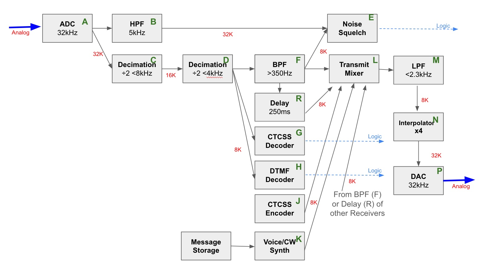
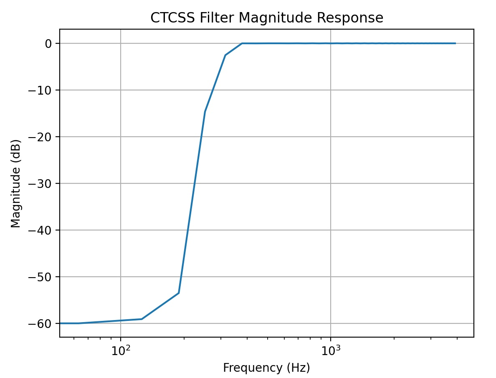

Overview
========

This is a basic two-radio repeater controller that can be used 
to create an amateur or GMRS repeater site. Our goal is to implement
as much of the repeater functionality in software as 
possible. For this reason, we call this the "Software 
Defined Repeater Controller" (SDRC) project. This Github
repo contains the source code for the controller and the 
KiCad design files for the hardware.

The hardware is on two boards. The radio interface board is on the left
and the digital control board is on the right. The digital control board
is mostly a Pico Pi 2. (To avoid any confusion: the Pico is an ARM Cortex-M33 microcontroller. This _is not_ a Linux system like you'd find on a full 
a Raspberry Pi single-board computer).


One of the advantages of an all-digital architecture is that integration
with other digital-voice technologies should be seamless. Please
see the related project called [MicroLink](https://github.com/brucemack/microlink) which
provides a compact EchoLink implementation. Soon the SDRC and MicroLink
systems will be integrated. Reverse-engineering of the D-Star/DMR protocols
will also enable direct integration of those modes at some point. 

Much of the hardware used in traditional analog repeater designs
(analog cross-point switches, FPGAs, custom DTMF/CTCSS tone detection chips, 
digital voice CODECs, voice delay modules, M7716 noise squelch ICs, etc.) will not be necessary
if these functions can be performed in software.

A [users guide is provided here](docs/users.md).

The SDRC system was developed by Bruce MacKinnon (KC1FSZ) with extensive design 
input from Dan Brown (W1DAN) of the Wellesley Amateur Radio Society (W1TKZ).
Please reach out with any questions/suggestions.


Capabilities
============

The development is in process. The prototype is undergoing bench 
testing at the moment. We plan to install it at our repeater site within the 
next month.

Key capabilities of the software so far:

* Support for two receivers and two transmitters. Radios
can operate independently or can be linked to support
remote receiver or cross-band repeater operation.
* Hardware COS and CTCSS inputs for each radio. Positive
and negative logic are supported.
* An optically-isolated hardware PTT output for each radio.
* Optional soft CTCSS (PL) tone encoding and decoding, with support 
for independent tone frequencies for each transmitter/receiver.
* Optional noise squelch using a bi-level system similar to 
the Motorola M7716 IC.
* CWID generation.
* Configurable hang time.
* Configurable courtesy tone generation.
* Timeout and lockout with configurable times.
* Optional digital voice ID and other prompts.
* Soft RX/TX gain control adjustable remotely.
* "Soft console" via USB-connected computer computer with
serial terminal provides a configuration shell and live display of the following:
  - Carrier detect (COS) status
  - PL tone detect (CTCSS) status
  - Push-to-talk (PTT) status
  - Receive/transmit audio level RMS and peak
* (In development) Remote firmware update via LoRa connection.
* (In development) <=1 second digital audio delay to avoid "static crashes."
* Microcontroller uses a watchdog timer to limit the risk of lockup.

Other things to know:

* The audio input/output range is around 1.5Vpp into 600 ohms.
* Hardware gain adjustments (pots) are used to calibrate dynamic range 
during initial installation.
* The audio path is about 10 kHz wide, which should be plenty for 
an FM analog repeater system.
* The controller runs on +12VDC power input.
* A DB25 connection is used for radio interfaces.
* Over-voltage protection is provided on the audio and logic inputs.
* Over-voltage, reverse-polarity, and transient spike protection is provided
on the power input.
* During testing of the prototype board it was determined that the 
controller consumes ~105mA when idling and ~135mA when repeating. These are
fairly low current consumptions that indicate the the controller may 
be relevant in solar/battery installations.

Hardware specs:

* Microcontroller is the RP2350 running at 125 MHz.
* ADC/DACs run at 32k samples/second with 24-bits of
resolution which is more than enough for an analog FM repeater.
* Low-noise op amps are used for audio scaling (TLV9152).

More documentation:

* A demonstration video of the current prototype 
[can be seen here](https://www.youtube.com/watch?v=HBwrpokd7FI).
* A demonstration video of the soft console [can be seen here](https://www.youtube.com/watch?v=gWjOw0UzMgY).
* The schematic for the main radio interface board [is here](https://github.com/brucemack/kc1fsz-rc1/blob/main/hw/if-2/plots/if-2.pdf).
* The schematic for the microcontroller board [is here](https://github.com/brucemack/kc1fsz-rc1/blob/main/hw/digital-2/plots/digital-2.pdf).
* The hardware project for the LoRa integration [is here](https://github.com/brucemack/lora-r2).
* The software project for the LoRa integration [is here](https://github.com/brucemack/remote-probe).

Credit/Thanks
=============

I've received help from a lot of smart people on this project who have been very generous with their time:

* Dan Brown W1DAN, former president of the Wellesley Club.
* Tom Kinahan N1CPE, trustee of the W1TKZ repeater system.
* Leandra MacLennan AF1R
* Steve Kondo K1STK
* George Zafiropoulos KJ6VU. Among other things, George sells his own commercial repeater controllers.
* Jim Aspinwall NO1PC.  Jim is very experienced with repeaters and has engineered/maintained several multi-site systems. His [website is very interesting](https://www.no1pc.org/).

Legal/License
=============

This work is being made available for non-commercial use by the amateur radio community. Redistribution, commercial use or sale of any part is prohibited.

The hardware for this project is published under the terms of [The TAPR Open Hardware License](https://tapr.org/the-tapr-open-hardware-license).

The software for this project is published under the terms of [GNU GENERAL PUBLIC LICENSE](https://www.gnu.org/licenses/gpl-3.0.en.html).

Technical/Design Notes
======================

Typical Radio Audio Levels and Impedance 
----------------------------------------

I got these comments from an experienced expert:

> ... we usually run the internal audio at a nominal 1v p/p for full system deviation.  That seems to have worked fine.  At the edges you may need more of a voltage swing especially on the output depending on the transmitter you are driving but this covers 90%++ of the cases.

> Discriminator / modulator audio inputs are never 600 Ohms.  The output impedance of the receiver is higher.  Often 5k to 10k Ohms, the modulator inputs are typically low impedance which is fine for an op amp output.  Both unbalanced.

Op Amp Notes
------------

* [TLV9152](https://www.ti.com/lit/ds/symlink/tlv9152.pdf?ts=1750522536760) - Suggested by Dan, output rail-to-rail, noise 10.5nV/RHz. This is the part that is in the current design.
* [TL072]() - Output to within +/- 1.5V (typ) of rail. A good part,
but very old. Used in initial prototypes.
* [LMC660](https://www.ti.com/lit/ds/symlink/lmc662.pdf) - Used in SCOM-7K, output rail-to-rail, can drive +/- 18mA.  Characterized as 4.6 to 0.3 output swing with R<sub>L</sub> = 600 ohms. A quad device, not a good choice.
* [TS952](https://www.st.com/content/ccc/resource/technical/document/datasheet/b8/ac/21/72/20/a7/4d/ea/CD00001338.pdf/files/CD00001338.pdf/jcr:content/translations/en.CD00001338.pdf) - Used in the SCOM 7330, output close to rail-to-rail with R<sub>L</sub> = 600 ohms.
* [TLV2462](https://www.ti.com/lit/ds/symlink/tlv2462-q1.pdf?ts=1750512090542) - Output rail-to-rail, can drive +/- 80mA. Noise 11nV/RHz.

Notes on Zener Biasing for Single Supply Op Amps
------------------------------------------------

From [Analog Devices application note AN-581](https://www.analog.com/en/resources/app-notes/an-581.html):

A Zener should be chosen that has an operating voltage close to Vs/2. Resistor RZ needs to be selected to provide a high enough Zener current to operate the Zener at its stable rated voltage and to keep the Zener output noise low. It is also important to minimize power consumption (and heating) and to prolong the life of the Zener. As the op amp’s input current is essentially zero, it’s a good idea to choose a low power Zener. A 250 mW device is best but the more common 500 mW types are also acceptable. The ideal Zener current varies with each manufacturer but practical IZ levels between 5 mA (250 mW Zener) and 5 µA (500 mW Zener) are usually a good compromise for this application.

Overview of Digital Signal Flow
-------------------------------

This diagram shows the flow between one receiver and one
transmitter. Keep in mind that multiple instances of 
this flow are running in parallel for each receiver/transmitter
pair. Furthermore, transmit audio can select/mix from
any of the receivers.



The letters in the diagram above will be referenced throughout.

Technical notes on the ADC
--------------------------

The ADC is a TI PC1804 (Flow diagram ref A). This was selected 
because of its simplicity,
availability, and ease of soldering. This is a 24 bit converter
so full scale runs from +/- 8,388,608. The digital interface 
is I2S.

The converter supports a range of conversion rates from 32k
to 192k.  The lowest possible rate has been selected for this
project.

This converter IC has two built-in filters:
* A low-pass
anti-aliasing filter with a cutoff frequency of f<sub>s</sub>/2.
* A high-pass filter just above 0Hz for DC removal. Testing
has shown that this filter is sharp and doesn't attenuate
the very low audio frequencies used for CTCSS/PL tones.

Technical Notes on Decimation From 32k to 8k Audio
--------------------------------------------------

The ADC runs at a sample rate of 32k.  In order to 
reduce memory and CPU requirements the audio stream is down-sampled
to 8k (decimation by 4). See flow diagram reference C and D. 
Following the decimation, most
audio processing in the rest of the flow will run at 8k.

This decimation happens in two ÷2 steps. Each decimation step
also includes a half-band LPF so the decimation has 
the effect of band-limiting the audio to 4kHz.

Technical Notes on CTCSS Tone Elimination
-----------------------------------------

The received CTCSS/PL tone needs to be filtered away so that it 
isn't repeated.  This is particularly
important for cross-band repeaters where the *PL tone might 
be different* on the two sides of the repeater.
"Pass-through" CTCSS tone is not desired. If the CTCSS encoder 
is enabled the appropriate tone will be synthesized and added
back to the transmitted signal on the way out.

A [commercial high-pass filter for CTCSS rejection](https://www.masterscommunications.com/products/filter/plf15.html) created by K3KKC and characterized in this
[review by WA1MIK](https://www.masterscommunications.com/products/filter/fl10-eval/fl10-evaluation.html) includes some specifications that can be 
used to guide the design. This filter has a 350Hz 
-3dB frequency and 30dB per octave of steepness.  That's down 
about -68dB at 50Hz. There is a response curve provided
in the WA1MIK article.

K3KKC's filter is analog, but this is a software-defined controller so 
I am replicating this filter behavior using a digital FIR filter 
that is synthesized using the "optimal" (Parks McClellan) algorithm. 
I'm going to assume the transition band starts at 200 Hz (i.e. the 
end of the stop band) and ends at 350 Hz (i.e. the start of the 
pass band). See flow diagram reference F.

We can estimate the number of taps required to perform this
filtering task 
using the so-called "Harris Approximation" (see *Multirate Signal Processing for Communication Systems*, Fredric J. Harris, 2004, page 216, equation (8.16)).

taps = (f<sub>s</sub> / Δf) * (dB<sub>att</sub> / 22)

where dB<sub>att</sub> is the desired attenuation of the stopband
and Δf is the desired width of the transition band.

Using Δf of (375-200) = 175 Hz and dB<sub>att</sub> of 
-68dB, we end up with a requirement of about 141 taps. Unfortunately,
it turns out that my [Parks McClellan implementation](https://github.com/brucemack/firpm-py) is limited to 127 taps at the moment, so
we'll just assume that is close enough. I'll fix that later
if it seems like this matters.

The group-delay of an FIR filter is approximately:

samples<sub>delay</sub> = (N - 1) / 2 

So this filter introduces about 8ms of delay into the system.

For reasons that will be explained later in the noise squelch
section, I added a stop band above 3kHz to this filter, so this 
is actually a band-pass filter from 350Hz to 3kHz. The important
part here is the low-end of the audio range since that is 
what is relevant to CTCSS tone elimination.

Here's a plot of the frequency response of the 127-tap filter
created by the PM algorithm created using Matplotlib:



As a sanity check I ran a 200 Hz tone through the
synthesized filter (amplitude 
1.0) and plotted the output. The amplitude of the output is about 0.0025,
or about -52dB, so things look pretty good on the low end of the
transition band.


As another sanity check I ran a 350 Hz tone through the same
filter and plotted the output. The amplitude is about 0.9, or about 
-0.9dB, so the high end of the transition is looking reasonable as
well.


This 127 tap filter should work fine for the purposes of CTCSS
filtering.

Technical Notes on CTCSS Tone Decoder
-------------------------------------

See flow diagram reference G.

(To be written)

Technical Notes on CTCSS Tone Encoder
-------------------------------------

See flow diagram reference J.

Dan suggested that tones (ex: CWID) should be generated at a level of between
-14dB and -10dB of full DAC full scale.  A tone of -10dB down should scale 
by 10<sup>(-10/20)</sup> = 0.32 linear scale. 

The PL tone should be another -12dB down, or 0.32 * 0.25 = 0.08 linear scale.

Technical Notes on CW Generator
-------------------------------

See flow diagram reference K.

Envelope shaping is using to avoid high frequency glitches
associated with on/off keying.

Technical Notes on Voice Synthesis
----------------------------------

See flow diagram reference K.

To reduce storage, voice prompts are compressed using the 
GSM 0610 full-rate CODEC. [I created a fixed-point implementation](https://github.com/brucemack/gsm-0610-codec) of 
this CODEC as part of my [Echolink Implementation](https://github.com/brucemack/microlink). GSM 0610 runs at 8k so this 
is a smooth integration.

(More to follow on this)

Technical Notes on Transmit Bandwidth Limit
-------------------------------------------

See flow diagram reference M.

(To be written)

Technical Notes on the Noise Squelch IC From Motorola
-----------------------------------------------------

Not all radios have access to a reliable COS signal and some 
radios may have inferior noise squelches. There are a few 
ways to deal with this. Jim NO1PC made me aware of an 
interesting component introduced in the Motorola MICOR stations of 
the 1970's to address this challenge. 

The goal of these circuits is to identify the end of a 
transmission as quickly as possible and to squelch (mute) the 
transmitter before the "static crash" is broadcast. If this
detection can be made quickly enough we can avoid the need
to create delayed versions of the receive audio stream.

It turns out that Motorola created a custom IC to address
this need.  The IC is called either the M7716 or the M6709, 
or sometimes the SC7716. The IC implements something called
"switched hysteresis squelch."

The Repeater Builder site has a few different articles that 
go into the details of this chip.
* [This article by WAØAUQ](https://www.repeater-builder.com/micor/micor-bi-level-squelch-circuit.html) gives a good overview.
* [This article by W3KKC](https://www.repeater-builder.com/micor/micor-bi-level-squelch-theory.html) also provides some theory.
* [The most detailed article is by Robert W. Meister WA1MIK](https://www.repeater-builder.com/micor/m6709-info/m6709-info.html). Robert
has done a reverse engineering of the chip in order to quantify 
it's behavior.

Quoting from WA1MIK's analysis, a _"noise squelch systems must ignore signals in the voice frequency range of about 300 to 3400 Hz. All of the high-pass filtering is designed to eliminate any voice energy and only look at the noise energy above 
about 5 kHz."_ Conceptually, a "quieted" FM channel would contain 
most of its energy concentrated in the voice band, whereas noise is broadband. 

And from W3KKC's article: _"If the received quality of the input 
signal provides at least 20 dB quieting, (above 1 uV on properly 
working receiver), the IC's logic circuit gives immediate audio 
shut-off, and no squelch tail. If the signal is below 20 dB 
quieting, (below 1 uV, or having some noise), there is a squelch 
tail of 150 milliseconds, long enough so there is no audio 
chopping under "flutter" conditions ..."_. The chart entitled "M6709 Squelch Tail Threshold" in the WA1MIK analysis article summarizes 
this bi-level behavior on the squelch tail.

There are a few things that I'm assuming from these articles, 
although not explicitly stated:

* When the articles talk about "20dB of quieting," I'm pretty
sure this is referring to a measurement of the ratio between 
the voice-band energy (<4kHz) to the above-voice-band energy (>5kHz). Since there is always output coming from an FM discriminator, the 
only way to determine
if that discriminator output is a signal is to determine 
when the noise part of the spectrum has quieted down sufficiently.
* From the WA1MIK tail threshold chart, I am assuming that 
the 10dB of quieting is the threshold for opening the squelch.
* The articles use the term "hysteresis" when describing 
the M7716's functionality. It's not explicitly stated where
the hysteresis loop manifests itself. I am assuming that this
is referring to the fact that the mute to unmute transition 
is immediate but the unmute to mute 
transition is delayed by 150ms (configurable) in the case that a <20dB quieted
signal is lost.
* For example, I am assuming that a transition from 9dB of 
quieting to 21dB and back to 9dB
would result in the squelch immediately opening and
then immediately closing, without delay or asymmetry.
* I am also assuming that if the signal goes above 10dB at any 
time during
the 150ms delay period that the delay counter is reset and
will start to count down again once the signal dips below
10dB of quieting again.

Technical Notes on My Implementation of a Noise Detector
--------------------------------------------------------

Given the theory about the M7716 above, we need to have
a measure of the noise energy present in an input signal.
This is a place where having an overly-wide (32kHz) ADC 
sampling rate is a good thing. 

A high-pass filter is used to extract the energy above
5kHz (see flow diagram reference B).  If the transition 
band of this filter starts 
at 4kHz and ends at 6kHz and -30dB of attenuation is 
sufficient, the Harris Approximation tells us that a 
21-tap FIR should be sufficient.

This FIR filter is runs directly on the 32kHz sampled
audio from the ADC. Every 10ms an RMS level is computed
that is used for the noise squelch feature described
below.

Technical Notes on My Implementation of Noise Squelch
-----------------------------------------------------

I am replicating the behavior of the M7716 in software.
Here are some notes on the implementation.

First, we need to measure the level of quieting of an incoming
signal. We'll do this by computing the ratio of the energy 
in the audio band to the energy in noise band. 

20 * log(RMS<sub>audio_band</sub>/RMS<sub>noise_band</sub>)

This calculation is done every 10ms using contemporaneous 
blocks of samples from the output of the CTCSS filter 
and the RMS value from the high-pass noise detector. Remember
that the CTCSS filter has a pass-band that goes from 350Hz to 3kHz, so 
this filter gives good coverage of the audio band.

When the S/N ratio goes above 10dB a valid signal is detected.
This threshold is configurable.

See flow diagram reference E.

Technical Notes on Audio Interpolation Up To 32k
------------------------------------------------

See flow diagram reference N. 8k audio needs to 
be up-sampled to 32k before being passed to the DAC.

(To be documented)

Technical Notes on Digital to Analog Conversion
-----------------------------------------------

See flow diagram reference P.

The TI PCM5100 is used for digital to analog conversion.
This part has been chosen because it is easy to use,
available, and easy to solder. The part supports a 
wide range of conversion rates all the way down to 8k. However,
the DAC is setup to convert at 32k since it is sharing 
I2S clock lines with the ADC.

Importantly, the DAC contains a low-pass reconstruction
filter that runs at f<sub>s</sub> / 2.

Testing has shown that DAC has sufficient low-end response
to pass the frequencies needed to encode CTCSS/PL tones.

Relevant FCC Regulations
========================

### FCC Part 97 Section 119: Station identification

(a) Each amateur station, except a space station or telecommand station, must transmit its assigned call sign on its transmitting channel at the end of each communication, and at least every 10 minutes during a communication, for the purpose of clearly making the source of the transmissions from the station known to those receiving the transmissions. No station may transmit unidentified communications or signals, or transmit as the station call sign, any call sign not authorized to the station.

### FCC Part 97 Section 213: Telecommand of an amateur station.

An amateur station on or within 50 km of the Earth's surface may be under telecommand where:

(a) There is a radio or wireline control link between the control point and the station sufficient for the control operator to perform his/her duties. If radio, the control link must use an auxiliary station. A control link using a fiber optic cable or another telecommunication service is considered wireline.

(b) Provisions are incorporated to limit transmission by the station to a period of no more than 3 minutes in the event of malfunction in the control link.

(c) The station is protected against making, willfully or negligently, unauthorized transmissions.

Build/Debug Commands
====================

One-time setup of make process:

        git submodule update --init
        mkdir build
        cd build
        cmake -DPICO_BOARD=pico ..

Build:

        cd build
        make

Pulling latest submodules:

        git submodule update --recursive --remote

Flash code to board:        

        ~/git/openocd/src/openocd -s ~/git/openocd/tcl -f interface/cmsis-dap.cfg -f target/rp2350.cfg -c "adapter speed 5000" -c "rp2350.dap.core1 cortex_m reset_config sysresetreq" -c "program main.elf verify reset exit"

Serial Console
==============

Connect serial-USB module to GPIO0/GPIO1 pins and use this command:

        minicom -b 115200 -o -D /dev/ttyUSB0

Wiring Notes (Revision B)
=========================

Pico 2 Pinout Notes
```
GP0  - (Reserved for UART0 TX)
GP1  - (Reserved for UART0 RX)

GP2  - I2C SDA
GP3  - I2C SCL
GP4  - I2S SCK out to PCM1804 ADC and PCM5100 DAC
GP5  - RST out to PCM1804 ADC

GP6  - I2S DIN in from PC1804 ADC
GP7  - I2S BCK out to PC1804 ADC
GP8  - I2S LRCK out to PC1804 ADC
GP9  - I2S DOUT out to PCM5100 DAC

GP10 - I2S BCK out to PCM5100 DAC
GP11 - I2S LRCK out to PCM5100 DAC
GP12 - Radio 0 PTT Out
GP13 - Radio 0 CTCSS In
GP14 - Radio 0 COS In
GP15 - Radio 1 PTT Out
GP16 - Radio 1 CTCSS In
GP17 - Radio 1 COS In

GP18 - LED0 Out
GP19 - X
GP20 - X
GP21 - X

GP22 - X
GP26 - X
GP27 - X
GP28 - X
```

Bring Up Test
=============

* Factory reset on the configuration
* Set signal generator for 1Vpp on both sides
* Adjust trimmers to show -10dB receive level on status (leaving headroom)
* Change receive soft gain on both sides to validate proper functionality 
* Turn on test tone, set to -10dB and 1000 Hz
* Validate transmit level on status is -10dB
* Adjust trimmers to output 1Vpp
* Change level of test tone to -13dB, validate output on status and see the output at around 700mVpp
* Turn off test tone
* PL tone generation test
  - Turn on PL tone on both sides, -10dB, 100 Hz
  - Validate -10dB TX signal on status
  - View signal on scope to validate ~1Vpp
  - Turn off PL tone on both sides
* COS signal (do on both sides)
  - Set COS mode to external, active high (2)
  - Move signal, validate on status
  - Set COS mode to external, active low (1)
  - Move signal, validate on status
* CTCSS signal (do on both sides)
  - Set rxtonemode to external, active high (2)
  - Move signal, validate on status
  - Set rxtonemode mode to external, active low (1)
  - Move signal, validate on status
 * Active test
  - Set rxtonemode to ignore on both sides (0)
  - Set cosmode to external active high on both sides (2)
  - Key each side and validate active status 
  

Work In Process
===============
Firmware
* Address audio bandwidth issues (PL tone strip, audio BW limiting to prevent interference)
* Implement emulation of the M7716 squelch chip.
* Separate Morse ID from voice ID 
* Implement polarity control PTT pins
* DTMF decode and TX shutoff commands.
* Improve layout of live status page
* Come up with a way to load voice prompts
* Load rest of voice prompts
* AGC experimentation
* Implement blended audio mode

Hardware
* Enclosure
* Change to MOSFET switch for PTT
* Overvoltage protection testing
* Send board revision to fab
* Live test at NWH
* Self-test feature

