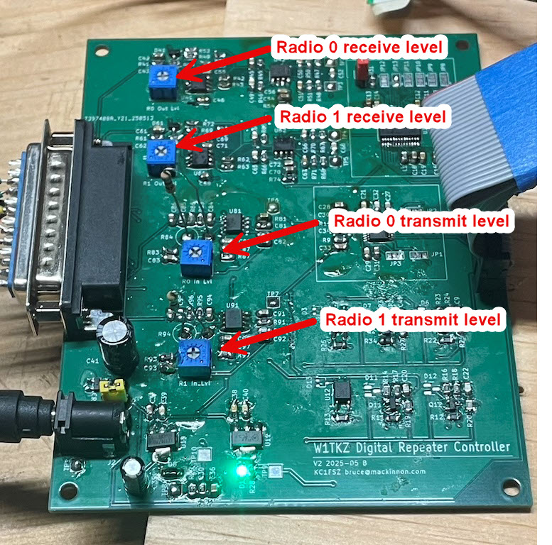
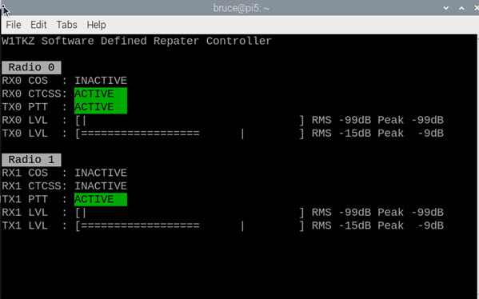

# Software Defined Repeater Controller - User Guide

This is the user guide for the [W1TKZ Software Defined Repeater Controller](https://github.com/brucemack/kc1fsz-rc1). Please contact KC1FSZ with any questions or corrections.

## Firmware Flash Update (Local via USB)

The controller board comes with the firmware installed. There may be 
instances when the firmware needs to be updated. The Pico architecture
makes firmware updates easy:

* Disconnect the digital board from the radio interface board.
* Connect a USB micro cable to the connector on the Pico Pi 2. 
* Hold down the BOOTSEL button on the Pico and plug the USB cable into a computer.
* The Pico should appear as a USB-connected storage device.
* Copy/drag the main.uf2 file into the root folder of the Pico.
* The controller should restart with the new firmware.
* Connect to the console interface (see below), enter the command shell,
and use the version command to validate the firmware version.
* Configuration settings may need to be re-applied after a firmware flash.

## Firmware Flash Update (Remote via LoRa)

(Work in process)

## Connectors

### Power Connector

Standard 5.5mm power connector. +12VDC on center pin.

### DB25 Radio Connector

The radios connect via a DB25 (female) connector.  The pinout should 
look a bit familiar to users of the SCOM-7000.

| Pin | Function                | IO |
|-----|-------------------------|----|
| 1   | Radio 0 audio in (10kΩ) | I  |
| 2   | Radio 0 COS             | I  |
| 3   | Radio 1 COS             | I  |
| 4   | NC                      |    |
| 5   | Radio 0 CTCSS           | I  |
| 6   | Radio 1 CTCSS           | I  |
| 7   | NC                      |    |
| 8   | Radio 1 audio in (10kΩ) | I  |
| 9   | NC                      |    |
| 10  | Radio 0 PTT             | O  |
| 11  | Radio 1 PTT             | O  |
| 12  | NC                      |    |
| 13  | NC                      |    |
| 14  | Radio 0 audio out (600Ω)| O  |
| 15  | Radio 1 audio out (600Ω)| O  |
| 16  | NC                      |    |
| 17  | NC                      |    |
| 18  | NC                      |    |
| 19  | Ground                  |    |
| 20  | Ground                  |    |
| 21  | Ground                  |    |
| 22  | Ground                  |    |
| 23  | NC                      |    |
| 24  | NC                      |    |
| 25  | NC                      |    |

NOTES:
* The terms "audio in" and "audio out" should be interpreted from the perspective of the controller. The audio in pins take audio from a receiver and the audio out pins deliver audio to a transmitter.
* Audio in and out pins have DC blocking capacitors.
* Audio out pins support 0 to 1.5Vpp into a 600 ohm load. 
* The COS/CTCSS are 5V logic inputs. The software allows the polarity of these controls to be configured to support positive or negative logic (depending on radio)
* The PTT pins are open collector to ground *and can sink at most 50mA*.  Please plan accordingly if your transmitter PTT circuit involves a larger current requirement (i.e. mechanical relays, etc.)

### USB Connector

Male, USB-A. For console connection. Runs at 115,200 baud.

## Board Adjustments

All radios operate with different audio levels and at different impedances.
The 4 hardware gain controls are used to adjust receive and transmit audio levels
to make best use of the dynamic range of the controller. These hardware adjustments 
should be made during initial installation. Fine adjustments can be made to the 
audio level using the soft gain controls.

Use the test tone feature to generate a continuous transmit tone to adjust the transmit levels.

Use the receive level meter on the console to adjust the receive levels.

## Console Interface 

The console interface is accessed via the serial USB connection or via the LoRa 
link (in development). The console is accessed using a serial terminal program
that supports VT100 emulation. minicom (Linux, MacOS) and Putty (Windows) have been
used successfully. Other would work I'm sure.

The console operates in three modes, each described below.

### Log Mode

The controller boots into log mode. Log mode displays a continuously scrolling list
of timestamped controller activity messages.

For example:

        I: 000000:05.039 Transmitter keyed [0]                                  
        I: 000000:05.040 Transmitter keyed [1]                                  
        I: 000000:06.041 CWID start W1TKZ                                       
        I: 000000:06.044 CWID start W1TKZ                                       
        I: 000000:09.528 CWID end                                               
        I: 000000:09.531 CWID end                                               
        I: 000000:10.529 Transmitter unkeyed [0]                                
        I: 000000:10.532 Transmitter unkeyed [1]       

In log mode some keyboard inputs are supported:

* s - Go to shell mode (see below)
* t - Go to status mode (see below)
* i - Force an ID cycle
* d - Turn on/off the test tone

### Status Mode

Status mode displays a real-time dashboard of controller status. For example:

In status mode some keyboard inputs are supported:

* l - Go to log mode (see above)
* s - Go to shell mode (see below)
* i - Force an ID cycle
* d - Turn on/off the test tone

### Shell Mode

Shell mode provides an interactive command line that
can be used to view status and change configuration parameters
of the repeater controller.

#### ping
Responds with pong.

#### version
Displays firmware version information.

#### reset 
Causes a reboot.

#### status
Go to status mode (see above).

#### log
Go to log mode (see above).

#### save 
Saves the current configuration to flash.

#### factory
Restores the configuration to the factory defaults.

#### show
Displays the current configuration settings of the controller.

#### set testmode (0 | 1)
Turns on or off a test tone that can be used for adjusting transmit audio levels.

#### set testtonelevel (level_db)
Sets the level of the test tone.

(level_db) is the audio level in dB relative to full scale. Default is -10dB.

#### set testtonefreq (freq_hz)
Sets the frequency of the test tone.

(freq_hz) The test tone frequency in Hertz.  Default is 1000.

#### set call (callsign)
Sets the station callsign. Limit 16 characters, slashes are allowed.

#### set pass (password)
Sets the station password. Limit 16 characters. Used for secure access.
You should use numbers if DTMF access is being used.

#### set repeatmode (mode)

(mode) is one of the following:

* 0 - Two radios operate independently.
* 1 - Cross-radio repeat, exclusive. When both receivers are active at the same time,
the first to become active is repeated through both transmitters and the 
second receiver is ignored.
* 2 - Cross-radio repeat, mixed. When both receivers are active at the same time,
the audio from both receivers is mixed and transmitted through both transmitters. (Default)

#### set cosmode (radio) (mode)
Controls the carrier detect (COS) mode used by the radio.

(radio) is either 0 or 1.

(mode) is one of the following:

* 0 - No COS detection used.
* 1 - Hardware COS detect, active low polarity
* 2 - Hardware COS detect, active high polarity (default)
* 3 - Soft COS detect based on receive audio level

#### set cosactivetime (radio) (duration_ms)

(radio) is either 0 or 1.

(duration_ms) the length of time in milliseconds that the COS signal be on before it is considered active. Default is 25ms.

#### set cosinactivetime (radio) (duration_ms)

(radio) is either 0 or 1.

(duration_ms) the length of time in milliseconds that the COS signal be off before it is considered inactive. Default is 25ms.

#### set coslevel (radio) (level_db) 
Used for soft COS detect only.

(radio) is either 0 or 1.

(level) is the audio level in dB relative to full scale used to trigger the soft COS. Default is -20dB.

#### set rxtonemode (radio) (mode)

Controls the tone detect (CTCSS) mode used by the radio.

(radio) is either 0 or 1.

(mode) is one of the following:

* 0 - No CTCSS detection used.
* 1 - Hardware CTCSS detect, active low polarity.
* 2 - Hardware CTCSS detect, active high polarity (default).
* 3 - Soft CTCSS detect.

#### set rxtoneactivetime (radio) (duration_ms)

(radio) is either 0 or 1.

(duration_ms) the length of time in milliseconds that the CTCSS signal must be on before it is considered active.  Default is 25ms.

#### set rxtoneinactivetime (radio) (duration_ms)

(radio) is either 0 or 1.

(duration_ms) the length of time in milliseconds that the CTCSS signal be off before it is considered inactive. Default is 25ms.

#### set rxtonelevel (radio) (level_db) 

Used for soft CTCSS detect only.

(radio) is either 0 or 1.

(level_db) the audio level threshold that is used for CTCSS detection

#### set rxtonefreq (radio) (freq_hz) 

Used for soft CTCSS detect only.

(radio) is either 0 or 1.

(freq_hz) the CTCSS frequency being detected

#### set rxgain (radio) (adj_db)
Used to make fine adjustments to the receive audio level.

(radio) is either 0 or 1.

(adj_db) The receive audio is amplified/attenuated by this value. Default is 0dB.

#### set txtonemode (radio) (mode)

Controls the CTCSS encoding function.

(radio) is either 0 or 1.

(mode) is one of the following:

* 0 - No CTCSS tone is generated (default)
* 1 - CTCSS is generated in software 

#### set txtonelevel (radio) (level_db) 
Used for soft CTCSS encoding only.

(radio) is either 0 or 1.

(freq_hz) the level relative to full scale used when encoding 
the CTCSS tone.

#### set txtonefreq (radio) (freq_hz) 
Used for soft CTCSS encoding only.

(radio) is either 0 or 1.

(freq_hz) the CTCSS frequency being encoded.

#### set timeouttime (radio) (duration_ms)
Controls the longest continuous transmission before the transmitter times out and enters the lockout state. This feature is for the protection of the transmitter.

(radio) is either 0 or 1.

(duration_ms) milliseconds for timeout. Default is 120000 milliseconds (2 minutes).

#### set lockouttime (radio) (duration_ms)
Controls how long the radio is locked out (i.e. transmitter shut off) after a timeout condition is detected. This timer starts after the connected receivers go  inactive.

(radio) is either 0 or 1.

(duration_ms) milliseconds for lockout.  Default is 60000 milliseconds (1 minute).

#### set hangtime (radio) (duration_ms)

Controls the length of the hang interval time. The hang time starts when the receiver becomes inactive and ends when the courtesy tone is generated. The transmitter remains keyed during the hang time.

(radio) is either 0 or 1.

(ms) milliseconds for the hang interval.  Default is 1000ms.

#### set ctmode (radio) (mode)

Controls the courtesy tone mode

(radio) is either 0 or 1.

(mode) one of the following:

* 0 - No courtesy tone
* 1 - Single tone
* 2 - Upchirp (default)
* 3 - Downchrip

#### set ctlevel (radio) (level_db)
Controls the audio level of the courtesy tone.

(radio) is either 0 or 1.

(level_db) is the audio level in dB relative to full scale.

#### set idlevel (radio) (level_db)
Controls the audio level of the CW ID.

(radio) is either 0 or 1.

(level) is the audio level in dB relative to full scale.
