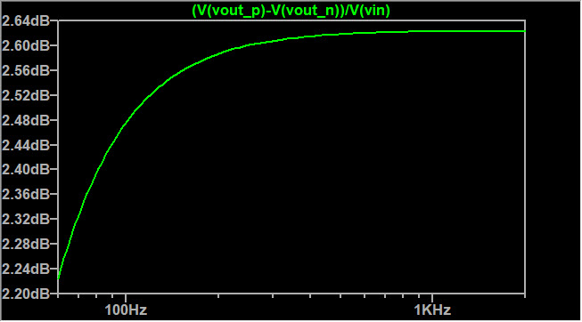
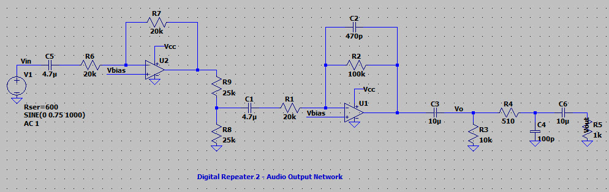
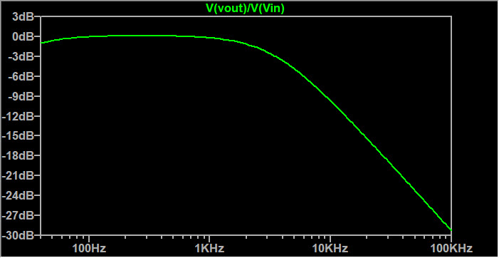
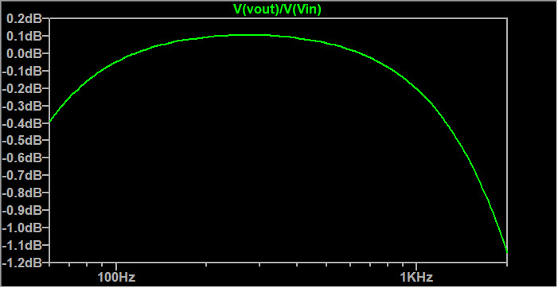

Simulation Notes
================

## Audio Input Network

Simulated audio input network:

Frequency response. We are using an ADC with a differential input so a differential gain is plotted:

Frequency response focusing on the range from 40 Hz to 4 kHz:

## Audio Output Stage 2

This is the final filter in the audio output chain. A low-pass network is used to suppress noise. This is not used for pre-/de-emphasis.

CTCSS tones need to pass through this network so very low frequency response is necessary.

The gain is provided in case the full-scale DAC amplitude isn't enough to drive the audio input of the radio.  

Simulated audio output network (stage 2):

Frequency response:

Frequency response focusing on the range from 40 Hz to 4 kHz:

